# Web Application Testing – Report

**Toth Dorian · Aichinger Marvin**

---

## Inhaltsverzeichnis

1. [Webanwendung: Rallly](#1-webanwendung-rallly)
2. [Test Setup](#2-test-setup)
   - 2.1 [Test-Frameworks](#21-test-frameworks)
   - 2.2 [Unit Tests](#22-unit-tests)
   - 2.3 [Integrationstests](#23-integrationstests)
   - 2.4 [E2E-Tests](#24-e2e-tests)
   - 2.5 [CI/CD Pipeline](#25-cicd-pipeline)
   - 2.6 [Test Isolation](#26-test-isolation)
3. [Load Tests](#3-load-tests)
   - 3.1 [Load Test – Marvin (vote-load.js)](#31-load-test--marvin-vote-loadjs)
   - 3.2 [Load Test – Dorian (load-test.js)](#32-load-test--dorian-load-testjs)

---

## 1. Webanwendung: Rallly

[Rallly](https://rallly.co) ist ein Open-Source-Terminplanungs-Tool, mit dem Gruppen gemeinsam den besten Termin für Meetings oder Veranstaltungen finden können. Nutzer erstellen eine Umfrage mit mehreren Datums- und Zeitoptionen, laden Teilnehmer über einen Link ein, und jeder stimmt ab, wann er verfügbar ist.

**Kernfunktionen:**
- Erstellen von Terminumfragen mit Datum- und Zeitoptionen
- Abstimmung per Ja / Falls erforderlich / Nein
- Kommentarfunktion
- E-Mail-Benachrichtigungen bei neuen Stimmen
- Geplante Events (`/e/<id>`) mit Accept/Decline-Funktion
- Nutzer-Registrierung, Login (Passwort, OTP, OAuth)
- Spaces (Workspace) mit Mitgliedern und Abrechnung (Pro-Tier)

**Tech-Stack:**
| Schicht | Technologie |
|---|---|
| Frontend | Next.js 16, React 19, TailwindCSS |
| API | tRPC |
| Datenbank | PostgreSQL via Prisma ORM |
| Auth | Better-Auth |
| Sprache | TypeScript |

**Screenshots der Anwendung:**

*Dashboard (Startseite nach Login):*

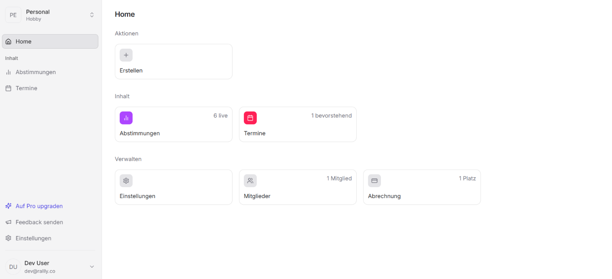

*Neue Umfrage erstellen – Kalenderansicht:*

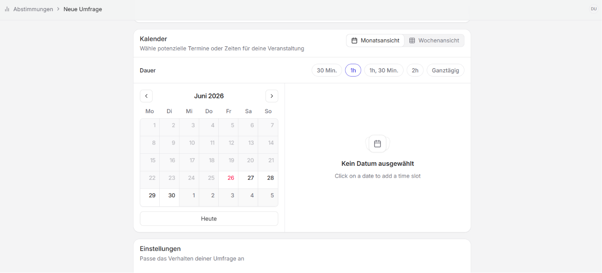

*Abstimmungsansicht einer aktiven Umfrage:*

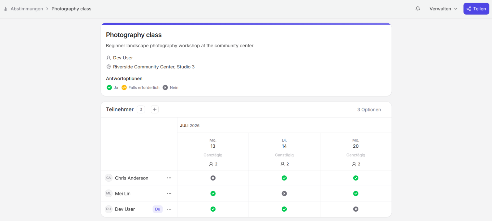

---

## 2. Test Setup

### 2.1 Test-Frameworks

Im Projekt werden drei verschiedene Test-Frameworks eingesetzt, jeweils passend zur Testart:

| Framework | Einsatzbereich | Konfiguration |
|---|---|---|
| **Vitest** | Unit Tests (Marvin) | `apps/web/vitest.config.mts` |
| **Jest** | Unit & Integrationstests (Dorian) | Im Monorepo integriert |
| **Playwright** | E2E-Tests | `apps/web/playwright.config.ts` |
| **k6** | Load Tests | `.js`-Skripte, CLI-Ausführung |

**Vitest-Konfiguration** (`apps/web/vitest.config.mts`):
```ts
export default defineConfig({
  plugins: [react()],
  test: {
    globals: true,
    environment: "jsdom",
    include: ["**/*.test.{ts,tsx}"],
    exclude: ["**/node_modules/**", "**/*.spec.ts"],
    setupFiles: ["./src/test/setup.ts"],
    css: true,
  },
});
```

**Playwright-Konfiguration** (`apps/web/playwright.config.ts`):
- Browser: Chromium (Desktop Chrome, 1280×720)
- `workers: 1` – sequenzielle Ausführung (verhindert Race Conditions)
- Traces bei Fehler (`trace: "retain-on-failure"`)
- Web-Server wird automatisch gestartet (`next dev` / `next start`)
- Playwright Report wird als CI-Artefakt hochgeladen

---

### 2.2 Unit Tests

#### Unit Tests – Marvin (Vitest)

Marvin hat Unit Tests mit **Vitest** geschrieben. Getestet werden interne Hilfsfunktionen im Bereich Datum/Zeit-Verarbeitung.

**Getestete Module:**
- `date-time-utils.ts` – `timezoneSchema`, `getDuration`, `expectTimeOption`, `removeAllOptionsForDay`
- `get-value-by-path.ts`
- `ics.ts`
- `encryption.ts` (Roundtrip, Security Properties, Tamper-Detection)

**Beispiel – `getDuration` und `removeAllOptionsForDay`:**

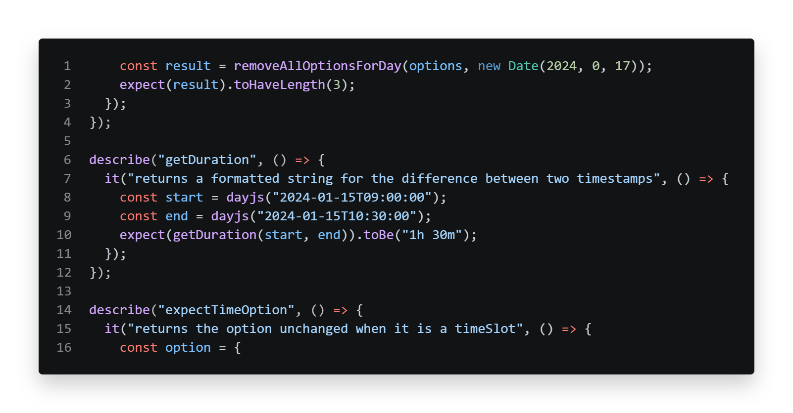

**Code-Coverage-Bericht (`web/src/utils`):**

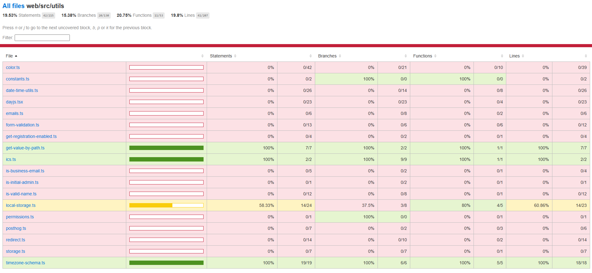

Die vollständig getesteten Dateien (`get-value-by-path.ts`, `ics.ts`, `timezone-schema.ts`) erreichen 100 % Statement-, Branch-, Function- und Line-Coverage. Andere Hilfsdateien wie `is-valid-name.ts` oder `is-business-email.ts` sind in diesem Coverage-Lauf noch nicht erfasst, da sie in Dorins Jest-Suite getestet werden.

---

#### Unit Tests – Dorian (Jest)

Dorian hat Unit Tests mit **Jest** geschrieben und dabei zwei Utility-Funktionen getestet:

**`isValidName`** – prüft, ob ein eingegebener Name ein gültiger Personenname ist (kein URL, keine E-Mail, keine Telefonnummer):

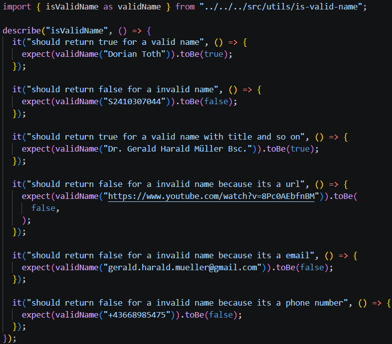

**`isBusinessEmail`** – prüft, ob eine E-Mail-Adresse zu einer Geschäftsdomain gehört (nicht Outlook, Gmail etc.):

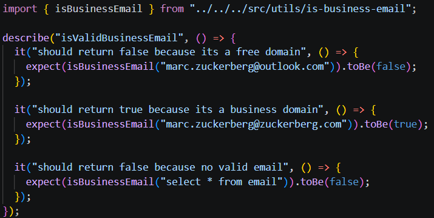

**Test-Ergebnisse (alle 3 Suites bestanden):**

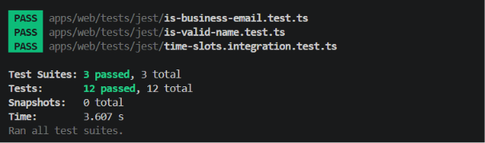

```
Test Suites:  3 passed, 3 total
Tests:       12 passed, 12 total
Time:         3.607 s
```

Die Testdateien liegen unter `apps/web/tests/jest/` und werden mit `jest` ausgeführt.

---

### 2.3 Integrationstests

#### Integrationstests – Marvin (Vitest / tRPC-Schema)

Marvin hat Integrationstests für die **private API-Route** geschrieben. Dabei wird das Zod-Schema `createPollInputSchema` validiert – insbesondere die Regel, dass `dates` und `slots` nicht gleichzeitig angegeben werden dürfen:

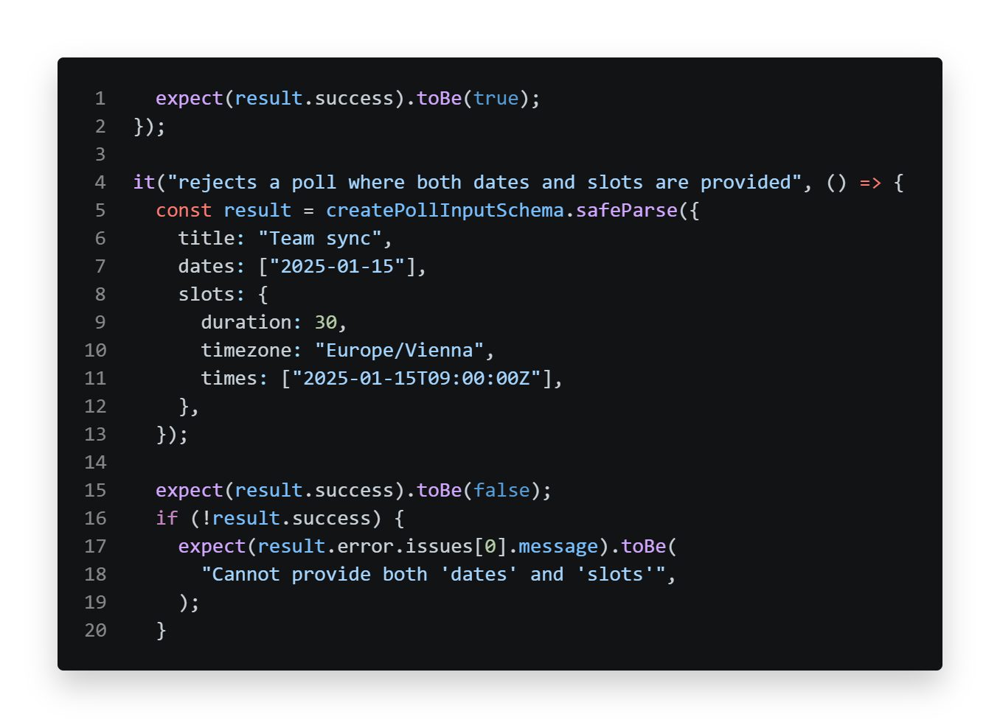

Diese Tests laufen direkt gegen die Validierungslogik ohne HTTP-Overhead und stellen sicher, dass ungültige Eingaben korrekt abgelehnt werden.

---

#### Integrationstests – Dorian (Jest / Time-Slots)

Dorian hat den **`/api/private/utils/time-slots`-Endpoint** mit Jest getestet. Der Test beschreibt die Funktionen `generateTimeSlots`, `dedupeTimeSlots` und `parseStartTime` und testet deren Zusammenspiel:

**Test 1 – Überlappende Slots aus zwei Generatoren werden dedupliziert:**

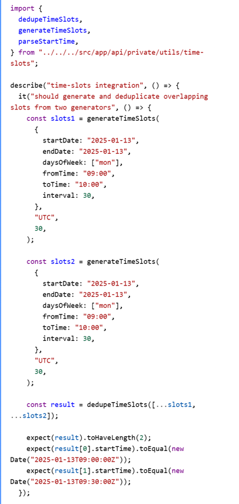

**Test 2 – Manuell geparster Start-Zeitpunkt wird mit generierten Slots zusammengeführt:**

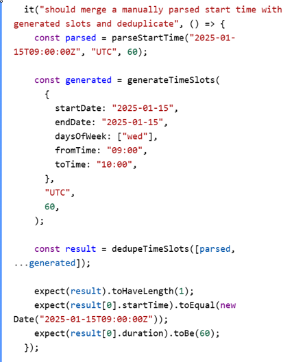

**Test 3 – Slots aus mehreren Generatoren über verschiedene Tage werden kombiniert und dedupliziert:**

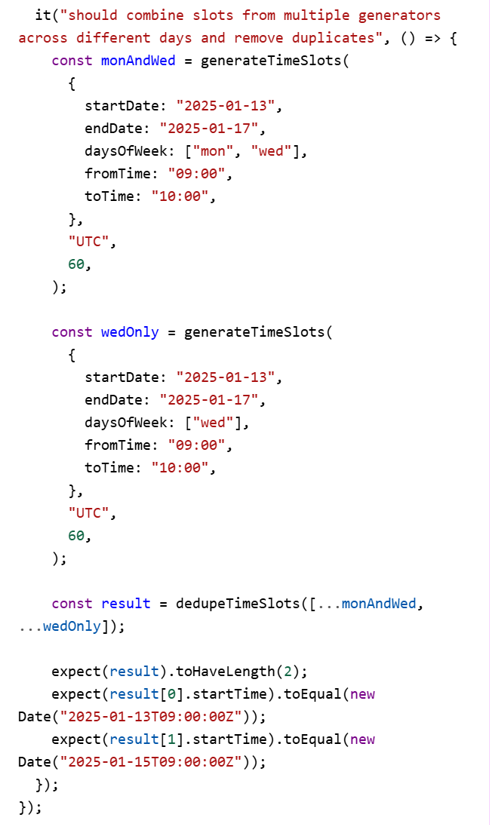

Die Tests stellen sicher, dass die Logik zur Zeitslot-Generierung korrekt funktioniert, bevor sie in der API genutzt wird.

---

### 2.4 E2E-Tests

Alle E2E-Tests werden mit **Playwright** ausgeführt. Die Tests befinden sich in `apps/web/tests/` und verwenden Page-Object-Klassen (`NewPollPage`, `PollPage`, `InvitePage`, `LoginPage`, `RegisterPage`) für saubere Test-Abstraktion.

#### E2E-Tests – Marvin (Playwright)

Marvin hat E2E-Tests für den **Poll-Management-Workflow** implementiert. Ein wesentlicher Test prüft, ob eine Umfrage geschlossen und über das Manage-Menü wieder geöffnet werden kann:

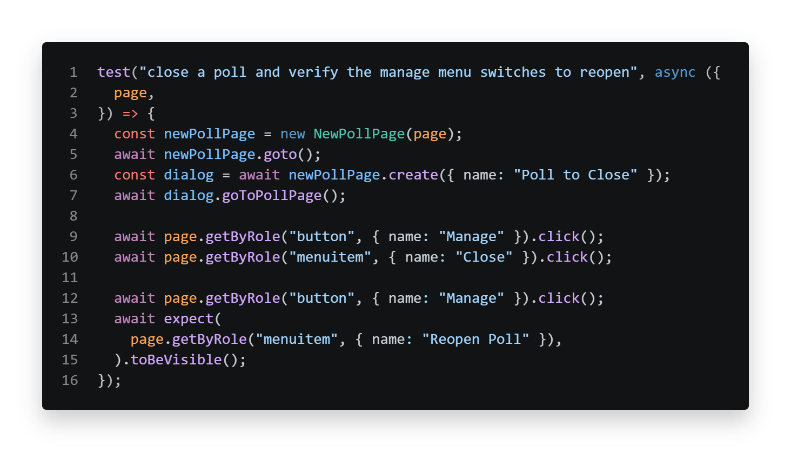

**Das getestete Manage-Menü in der Applikation:**

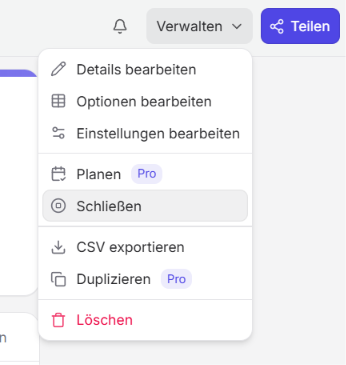

Weitere getestete Szenarien (aus dem bestehenden Test-Setup):
- Poll erstellen und löschen (`create-delete-poll.spec.ts`)
- Abstimmung und Kommentar hinzufügen (`vote-and-comment.spec.ts`)
- Optionen bearbeiten mit Warnung bei vorhandenen Votes (`edit-options.spec.ts`)
- House-Keeping-API: inaktive Polls markieren, gelöschte Polls entfernen, Polls automatisch schließen (`house-keeping.spec.ts`)

---

#### E2E-Tests – Dorian (Playwright)

Dorian hat E2E-Tests für die **öffentliche Event-Seite** (`/e/<eventId>`) geschrieben. Im `beforeAll`-Hook wird ein Test-Event direkt über Prisma in der Datenbank angelegt:

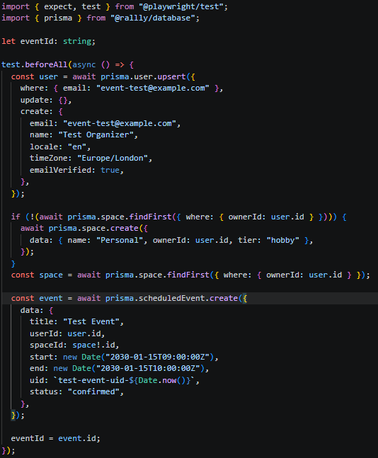

**Getestete Szenarien:**

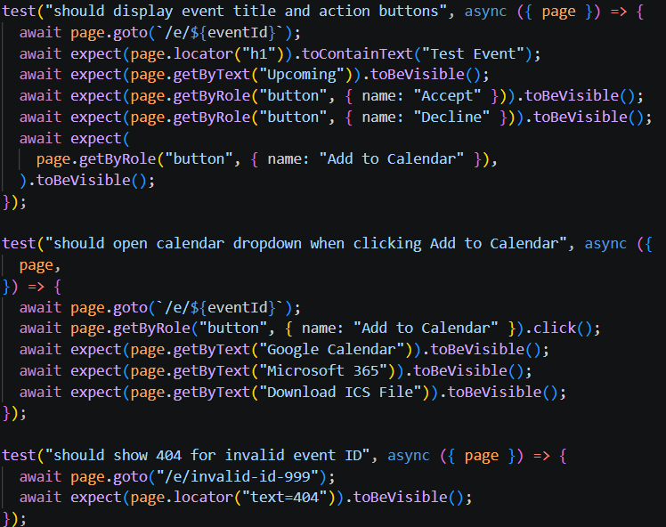

- Event-Titel und Aktions-Buttons (Accept/Decline/Add to Calendar) werden angezeigt
- Klick auf „Add to Calendar" öffnet das Dropdown mit Google Calendar, Microsoft 365 und ICS-Download
- Ungültige Event-ID zeigt eine 404-Seite
- Nicht-bestätigte Events zeigen einen Register-Button

Ältere Test-Variante für dieselbe Event-Seite (vor dem letzten Applikations-Update):

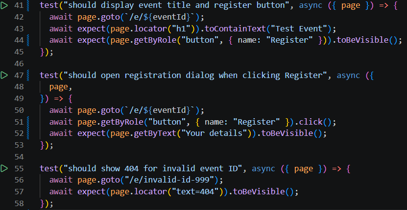

---

### 2.5 CI/CD Pipeline

Die CI/CD-Pipeline läuft auf **GitHub Actions** und wird bei jedem Push auf `main` sowie bei Pull Requests gegen `main` ausgelöst. Concurrency-Gruppen verhindern parallele Runs desselben Workflows.

**Pipeline-Übersicht:**

```
┌─────────────────┐  ┌──────────┐  ┌──────────┐
│   type-check    │  │  sherif  │  │ linting  │
└─────────────────┘  └──────────┘  └──────────┘
        │
┌───────▼─────────┐
│   unit-tests    │   pnpm test:unit (Vitest)
└─────────────────┘
        │
┌───────▼──────────────┐  ┌──────────────────────┐
│  docker-smoke-test   │  │  integration-tests   │
│  (docker compose up) │  │  (Playwright, CI)    │
└──────────────────────┘  └──────────────────────┘
```

**Jobs im Detail:**

| Job | Beschreibung |
|---|---|
| `type-check` | TypeScript-Typprüfung via `pnpm type-check` |
| `sherif` | Monorepo-Dependency-Konsistenzcheck |
| `linting` | Biome Linter/Formatter via `pnpm turbo check` |
| `unit-tests` | Vitest Unit Tests via `pnpm test:unit` |
| `docker-smoke-test` | Startet die gesamte App via `docker compose up --wait`, prüft ob sie hochkommt |
| `playwright-version` | Löst die exakte Playwright-Version aus `pnpm-lock.yaml` auf (für den Container-Image-Tag) |
| `integration-tests` | Playwright E2E-Tests in einem offiziellen Playwright-Container mit echtem PostgreSQL und Mailpit |

**Services für Integration Tests:**
- **PostgreSQL 18** (alpine): Echte Datenbank, Health-Check via `pg_isready`
- **Mailpit**: Lokaler SMTP-Server für E-Mail-Tests, Health-Check via HTTP

Die Playwright-Tests laufen gegen einen **Production Build** (`pnpm turbo build:test`), nicht gegen den Dev-Server. Nach dem Testlauf werden die Playwright-Reports als **GitHub Actions Artefakt** hochgeladen.

---

### 2.6 Test Isolation

Test-Isolation ist auf mehreren Ebenen sichergestellt:

**Datenbank-Isolation:**
- Jede CI-Pipeline hat eine **eigene frische PostgreSQL-Instanz** als Service-Container
- `pnpm db:deploy` führt alle Migrationen auf der leeren Datenbank aus
- Playwright-Tests mit `test.describe.serial()` laufen sequenziell (kein paralleles Schreiben)
- Tests, die Datenbankzustand brauchen, erstellen ihre Daten selbst via `beforeAll` und räumen in `afterAll` auf (z. B. `prisma.user.deleteMany(...)`)

**E-Mail-Isolation:**
- **Mailpit** fängt alle ausgehenden E-Mails ab – kein echtes SMTP
- Vor Tests, die E-Mails erwarten, wird `deleteAllMessages()` aufgerufen (sauberer Posteingang)
- E-Mail-Inhalte werden über die Mailpit REST-API (`MAILPIT_API_URL`) abgefragt

**Browser-Isolation:**
- Playwright erstellt für jeden Test eine neue `Page`-Instanz
- `browser.newContext({ locale: "de" })` ermöglicht isolierte Locale-Tests
- Berechtigungen (z. B. Clipboard) werden explizit konfiguriert

**Playwright-Worker:**
- `workers: 1` in der Playwright-Config – alle Tests laufen **sequenziell** in einem einzigen Worker, was Race Conditions bei gemeinsam genutzten Datenbankdaten verhindert

---

## 3. Load Tests

Load Tests wurden mit **k6** (Grafana k6) durchgeführt. k6 ist ein Open-Source-Load-Testing-Tool, das Tests in JavaScript/TypeScript geschrieben werden können und nativ HTTP-Requests, Checks und Metriken unterstützt. Die Skripte liegen unter `apps/web/tests/load/`.

---

### 3.1 Load Test – Marvin (`vote-load.js`)

**Zweck:** Simulation von gleichzeitigen Teilnehmern, die eine Umfrage aufrufen und abstimmen – der kritischste Write-Pfad der Applikation.

**Art des Tests:** Ramp-Up-Load-Test (Lastanstieg → Haltezeit → Ramp-Down)

**Testablauf:**
1. **Setup-Phase:** Jeder virtuelle User meldet sich anonym an (`/api/better-auth/sign-in/anonymous`), lädt die Poll-Optionen via tRPC und speichert Session-Cookie und Option-IDs
2. **Test-Phase:** Jeder VU sendet einen `polls.participants.add`-Request mit allen Optionen als „yes"-Vote

**Konfiguration:**
```js
export const options = {
  stages: [
    { duration: "30s", target: 500 },  // Ramp-up auf 500 VUs
    { duration: "60s", target: 500 },  // Haltezeit
    { duration: "20s", target: 0 },    // Ramp-down
  ],
  thresholds: {
    http_req_duration: ["p(95)<500"],  // 95 % der Requests unter 500 ms
    http_req_failed:   ["rate<0.05"],  // Fehlerrate unter 5 %
  },
};
```

**Vote-Payload (pro VU):**
```js
name: `Load Tester ${__VU}`,
votes: optionIds.map((id) => ({ optionId: id, type: "yes" }))
```

**Ergebnis – Terminalausgabe:**

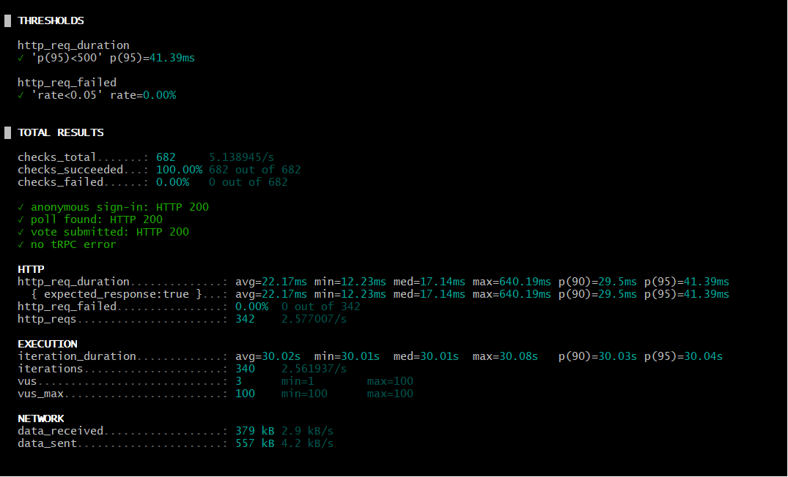

**Ergebnis-Zusammenfassung:**
| Metrik | Wert |
|---|---|
| Requests gesamt | 342 |
| Fehlerrate | 0.00 % |
| Durchschnittliche Latenz | 22.17 ms |
| Median-Latenz | 17.14 ms |
| P(95)-Latenz | 41.39 ms |
| Max-Latenz | 640.19 ms |
| Threshold `p(95)<500` | ✅ bestanden (41.39 ms) |
| Threshold `rate<0.05` | ✅ bestanden (0.00 %) |

**Checks:**
- `anonymous sign-in: HTTP 200` ✅
- `poll found: HTTP 200` ✅
- `vote submitted: HTTP 200` ✅
- `no tRPC error` ✅

**Abstimmungsergebnis in der Applikation** (die simulierten Load Tester sind als Teilnehmer sichtbar):

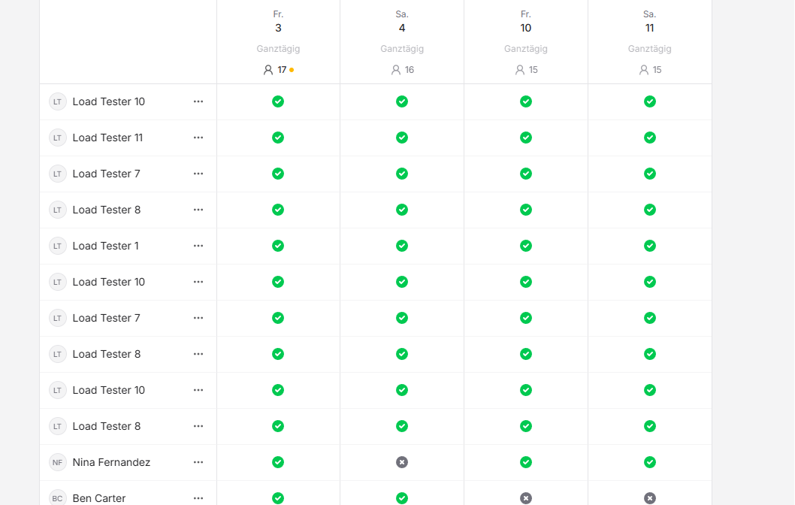

**E-Mail-Benachrichtigungen in Mailpit** (für jeden abgegebenen Vote wurde eine Notification-E-Mail versandt):

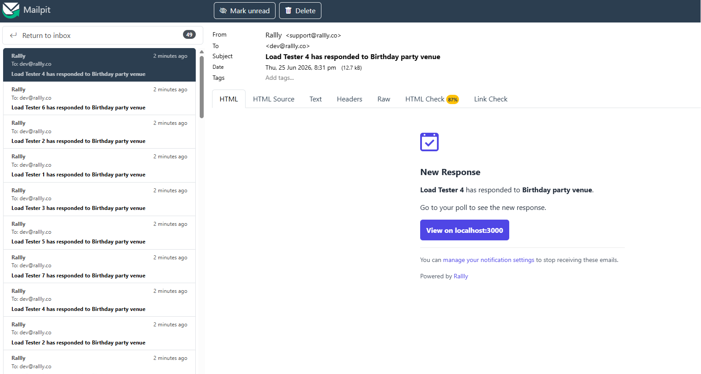

**Analyse:** Der Vote-Endpoint hat unter Spitzenlast (bis zu 500 VUs) alle definierten Schwellenwerte deutlich unterschritten. Die P(95)-Latenz von 41 ms liegt weit unter dem gesetzten Limit von 500 ms, und die Fehlerrate bleibt bei 0 %. Die E-Mail-Benachrichtigungen wurden korrekt für alle Teilnehmer ausgelöst, was zeigt, dass auch asynchrone Prozesse (E-Mail-Versand) unter Last stabil funktionieren.

---

### 3.2 Load Test – Dorian (`load-test.js`)

**Zweck:** Basistest der Homepage-Performance – der einfachste Read-Pfad der Applikation.

**Art des Tests:** Konstanter Load-Test (Fixed VUs über feste Dauer)

**Konfiguration:**
```js
export const options = {
  vus: 10,         // 10 gleichzeitige virtuelle User
  duration: "30s", // 30 Sekunden lang
};
```

Der Test sendet wiederholt GET-Requests auf `http://localhost:3002/` und prüft per `check()`:
- `status is 200` – HTTP-Statuscode ist 200
- `response time < 5s` – Antwortzeit unter 5 Sekunden

**Load-Test-Code:**

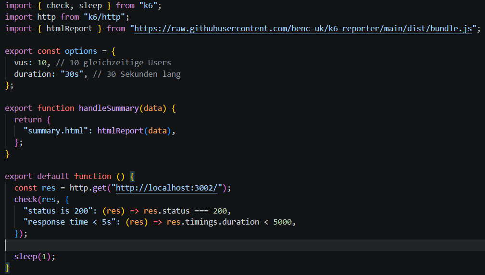

**Ausführung via k6-CLI:**

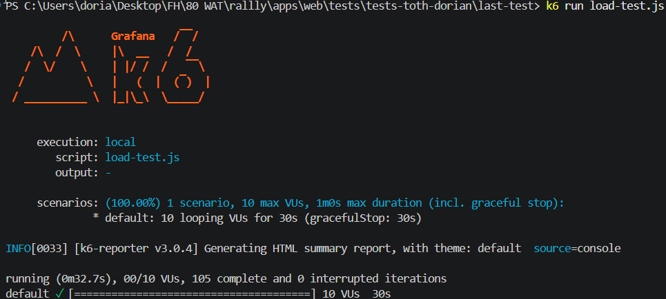

```
k6 run load-test.js
scenarios: 10 looping VUs for 30s
running (0m32.7s), 00/10 VUs, 105 complete and 0 interrupted iterations
```

**Ergebnisse – k6 HTML Report (Übersicht):**

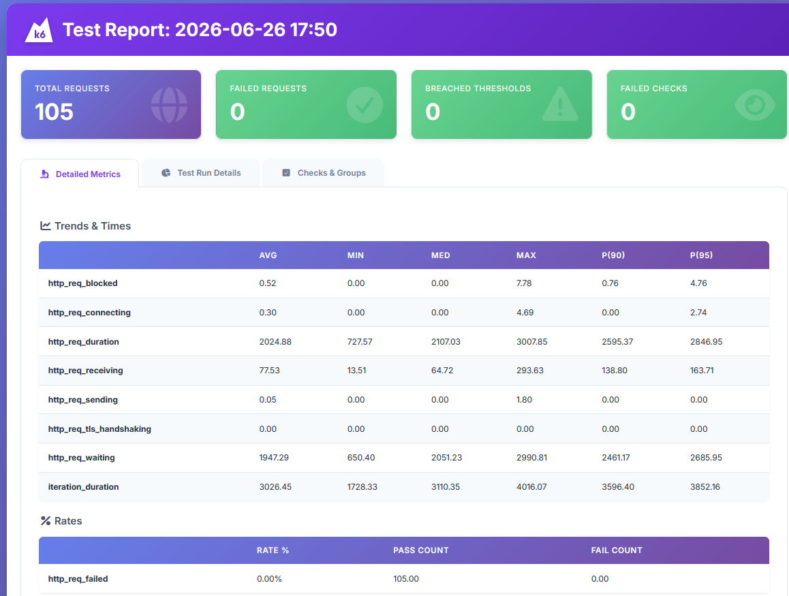

| Metrik | Wert |
|---|---|
| Total Requests | 105 |
| Failed Requests | 0 |
| Breached Thresholds | 0 |
| Failed Checks | 0 |

**Test Run Details:**

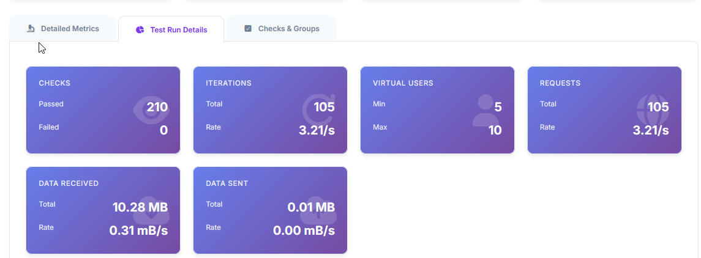

| Metrik | Wert |
|---|---|
| Checks passed | 210 / 210 |
| Checks failed | 0 |
| Iterationen gesamt | 105 |
| Iterations-Rate | 3.21/s |
| Virtuelle User (min/max) | 5 / 10 |
| Data received | 10.28 MB (0.31 MB/s) |
| Data sent | 0.01 MB |

**Detaillierte HTTP-Metriken:**

| Metrik | AVG | MIN | MED | MAX | P(90) | P(95) |
|---|---|---|---|---|---|---|
| http_req_duration | 2024.88 ms | 727.57 ms | 2107.03 ms | 3007.85 ms | 2595.37 ms | 2846.95 ms |
| http_req_waiting | 1947.29 ms | 650.40 ms | 2051.23 ms | 2990.81 ms | 2461.17 ms | 2685.95 ms |
| iteration_duration | 3026.45 ms | 1728.33 ms | 3110.35 ms | 4016.07 ms | 3596.40 ms | 3852.16 ms |

**Checks & Groups:**

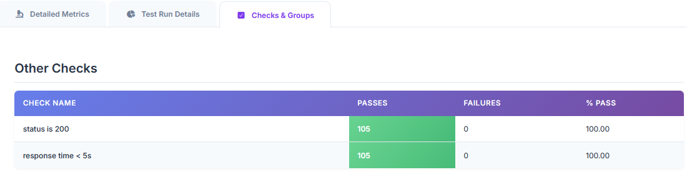

| Check | Passes | Failures | % Pass |
|---|---|---|---|
| status is 200 | 105 | 0 | 100.00 % |
| response time < 5s | 105 | 0 | 100.00 % |

**Analyse:** Die Homepage beantwortet alle 105 Requests erfolgreich (0 % Fehlerrate). Beide Checks (`status is 200` und `response time < 5s`) werden zu 100 % bestanden. Die durchschnittliche Antwortzeit von ~2 Sekunden ist erwartungsgemäß höher als beim Vote-Endpoint, da die Homepage ein vollständiges Server-Side-Rendering durch Next.js beinhaltet. Die maximale Antwortzeit von ~3 Sekunden liegt noch klar unter dem gesetzten Schwellenwert von 5 Sekunden. Das System bleibt unter der Last von 10 gleichzeitigen Usern über 30 Sekunden stabil und funktionsfähig.
